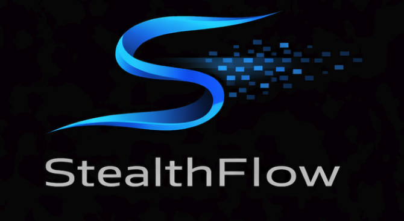

#  StealthFlow

**Privacy is a Right, Not a Feature.**

StealthFlow is a **Non-Interactive Stealth Address Protocol** built on **Starknet**. It enables users to receive funds privately without ever revealing their identity on-chain. By leveraging **Starknet's native ZK capabilities**, **Garaga** for efficient elliptic curve operations, and **Account Abstraction** for gasless claims, StealthFlow provides a seamless and truly private payment experience.

---

## 🚀 Key Features

### 🛡️ Non-Interactive Stealth Addresses
Receive payments without interacting with the sender. The sender generates a unique, one-time address for you based on your "Stealth Meta-Address". Only you can derive the private key for this address.

### 🕵️ Privacy Scanner (Client-Side)
Your privacy is preserved by keeping the scanning logic entirely on your device.
- **View Keys**: Use your View Private Key to scan the blockchain for payments.
- **1-Byte View Tags**: Our protocol uses a 1-byte announcement tag to quickly filter out 254/255 irrelevant transactions without performing expensive cryptography, making scanning lighting fast.

### ⛽ Gasless Claims
Withdraw your private funds without needing STRK for gas!
- **Zero-Funding Problem Solved**: Usually, a fresh stealth address has no ETH to pay for the withdrawal transaction.
- **Paymaster Integration**: StealthFlow uses a Paymaster to sponsor the gas fees.
- **Garaga Signatures**: We use **Garaga** to verify `secp256k1` signatures on-chain efficiently, allowing the stealth address to prove ownership and authorize the transfer to a relayer/paymaster without revealing the long-term identity.

### 🔐 Bitcoin/EVM Compatible Keys
StealthFlow uses the `secp256k1` curve (same as Bitcoin and Ethereum). This means you could potentialy use your existing wallets to derive stealth keys, bridging the gap between EVM privacy and Starknet scalability.

---

## 🛠️ Technology Stack

-   **Network**: Starknet Sepolia (Layer 2 ZK-Rollup)
-   **Smart Contracts**: Cairo 2.x
-   **Frontend**: Next.js 16 (App Router), TypeScript, Tailwind CSS
-   **Cryptography**: `starknet-js`, `noble-curves` (secp256k1), `Garaga` (On-chain EC arithmetic)
-   **Indexing**: 1-byte View Tags for efficient on-chain filtering.

---

## 📦 Project Structure

```
StealthFlow/
├── frontend/             # Next.js Web Application
│   ├── src/
│   │   ├── app/          # Dashboard & Routes
│   │   ├── components/   # UI Components (Scanner, Claim, etc.)
│   │   ├── contracts/    # Contract ABI and interactions
│   │   └── stealth-crypto.ts # Core Cryptography Logic
├── src/                  # Cairo Smart Contracts
│   ├── contracts/        # Registry & Paymaster Contracts
│   └── lib/              # Garaga integration & EC Utils
├── scripts/              # Python scripts for deployment & claiming
└── Scarb.toml            # Starknet Project Configuration
```

---

## 🚦 Getting Started

### Prerequisites
-   [Node.js](https://nodejs.org/) (v18+)
-   [Scarb](https://docs.swmansion.com/scarb/) (Cairo Package Manager)
-   [Starkli](https://github.com/xJonathanLEI/starkli) (Command Line Interface)

### 1. Smart Contracts
To build the contracts:
```bash
scarb build
```

### 2. Frontend
Navigate to the frontend directory and install dependencies:
```bash
cd frontend
npm install
```

Run the development server:
```bash
npm run dev
```
Open [http://localhost:3000](http://localhost:3000) to view the app.

---

## 📖 Privacy Flow

1.  **Generate Keys**: User generates a **Stealth Meta-Address** (Spend PubKey + View PubKey).
2.  **Send**: Sender uses the Meta-Address to derive a unique **Stealth Address** and sends funds to the `StealthRegistry`.
3.  **Scan**: Receiver's client scans `StealthAnnouncement` events. It uses the `View Key` to identify which announcements belong to them.
4.  **Claim**:
    -   Receiver identifies a payment.
    -   Receiver generates a transaction signature using the specific Stealth Private Key.
    -   **Gasless**: The transaction is sent via a Relayer/Paymaster. The contract verifies the signature using **Garaga** and releases the funds to the receiver's main wallet (or a fresh wallet) while refunding the relayer.

---

## 🤝 Contributing
Contributions are welcome! Please fork the repository and submit a pull request.

## 📄 License
MIT License.
